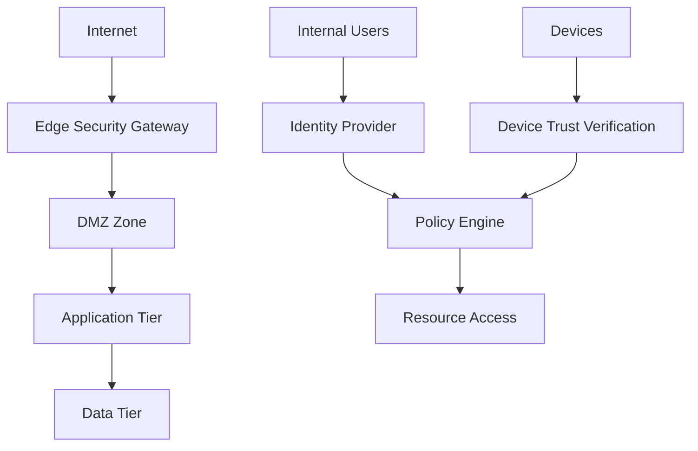

# Zero Trust Architecture: Implementation Guide for Large Organizations

## Executive Summary

Zero Trust Architecture (ZTA) represents a fundamental shift from perimeter-based security to a "never trust, always verify" model. This guide provides practical implementation strategies for large organizations transitioning to Zero Trust principles.

## Core Zero Trust Principles

### 1. Verify Explicitly
**Always authenticate and authorize based on all available data points**

```yaml
# Identity verification framework
identity_verification:
  factors:
    - user_identity: Multi-factor authentication
    - device_health: Endpoint compliance status
    - location_context: Geographic and network location
    - behavior_analytics: User and entity behavior analysis
    - time_context: Access patterns and timing
  
  decision_engine:
    risk_scoring: Real-time risk assessment
    adaptive_policies: Dynamic access controls
    continuous_monitoring: Ongoing verification
```

### 2. Use Least Privileged Access
**Limit user access with Just-In-Time and Just-Enough-Access (JIT/JEA)**

```python
# Dynamic privilege escalation example
class PrivilegeManager:
    def __init__(self):
        self.active_sessions = {}
        self.risk_calculator = RiskCalculator()
    
    def request_access(self, user_id, resource, duration_hours=2):
        risk_score = self.risk_calculator.assess_risk(
            user_id=user_id,
            resource=resource,
            context=self.get_current_context(user_id)
        )
        
        if risk_score < 0.3:  # Low risk
            return self.grant_access(user_id, resource, duration_hours)
        elif risk_score < 0.7:  # Medium risk
            return self.require_additional_verification(user_id, resource)
        else:  # High risk
            return self.escalate_to_security_team(user_id, resource, risk_score)
    
    def grant_access(self, user_id, resource, duration):
        session_id = generate_session_id()
        self.active_sessions[session_id] = {
            'user_id': user_id,
            'resource': resource,
            'granted_at': datetime.now(),
            'expires_at': datetime.now() + timedelta(hours=duration),
            'permissions': self.calculate_minimal_permissions(resource)
        }
        return session_id
```

### 3. Assume Breach
**Minimize blast radius and verify end-to-end encryption**

## Implementation Architecture

### Network Segmentation Strategy



### Micro-Segmentation Implementation

```yaml
# Kubernetes Network Policies for micro-segmentation
apiVersion: networking.k8s.io/v1
kind: NetworkPolicy
metadata:
  name: zero-trust-web-tier
spec:
  podSelector:
    matchLabels:
      tier: web
  policyTypes:
  - Ingress
  - Egress
  ingress:
  - from:
    - namespaceSelector:
        matchLabels:
          name: ingress-controller
    ports:
    - protocol: TCP
      port: 8080
  egress:
  - to:
    - podSelector:
        matchLabels:
          tier: api
    ports:
    - protocol: TCP
      port: 8000
  - to: []  # Block all other egress
    ports:
    - protocol: TCP
      port: 53  # Allow DNS only
```

## Identity and Access Management (IAM)

### Multi-Factor Authentication Framework

```python
# Adaptive MFA implementation
class AdaptiveMFA:
    def __init__(self):
        self.risk_engine = RiskEngine()
        self.auth_methods = {
            'low_risk': ['password', 'push_notification'],
            'medium_risk': ['password', 'totp', 'biometric'],
            'high_risk': ['password', 'hardware_token', 'biometric', 'admin_approval']
        }
    
    def authenticate(self, user_id, context):
        risk_level = self.risk_engine.calculate_risk(user_id, context)
        required_factors = self.auth_methods[risk_level]
        
        authenticated_factors = []
        for factor in required_factors:
            if self.verify_factor(user_id, factor, context):
                authenticated_factors.append(factor)
            else:
                return AuthResult(success=False, reason=f"Failed {factor}")
        
        if len(authenticated_factors) >= len(required_factors):
            return AuthResult(
                success=True,
                session_token=self.create_session(user_id, context),
                trust_level=self.calculate_trust_level(authenticated_factors)
            )
```

### Device Trust and Compliance

```yaml
# Device compliance policies
device_compliance:
  minimum_requirements:
    - os_version: "Current or N-1"
    - antivirus: "Enabled and updated"
    - firewall: "Enabled"
    - encryption: "Full disk encryption required"
    - patch_level: "Critical patches within 30 days"
  
  monitoring:
    - certificate_based_auth: True
    - device_health_attestation: Required
    - continuous_compliance_check: Every 4 hours
    - non_compliant_action: "Quarantine network access"
```

## Data Protection and Classification

### Data Classification Framework

```python
# Automated data classification
class DataClassifier:
    def __init__(self):
        self.classification_rules = {
            'public': {'encryption': False, 'access_logging': False},
            'internal': {'encryption': True, 'access_logging': True},
            'confidential': {'encryption': True, 'access_logging': True, 'dlp': True},
            'restricted': {'encryption': True, 'access_logging': True, 'dlp': True, 'approval_required': True}
        }
    
    def classify_data(self, data_content, metadata):
        classification = 'public'  # Default
        
        # Pattern-based classification
        if self.contains_pii(data_content):
            classification = 'confidential'
        if self.contains_financial_data(data_content):
            classification = 'restricted'
        if metadata.get('department') == 'legal':
            classification = 'restricted'
            
        return self.apply_protection_controls(data_content, classification)
    
    def apply_protection_controls(self, data, classification):
        controls = self.classification_rules[classification]
        
        if controls.get('encryption'):
            data = self.encrypt_data(data)
        if controls.get('dlp'):
            data = self.apply_dlp_markers(data)
            
        return {
            'data': data,
            'classification': classification,
            'controls': controls
        }
```

## Monitoring and Analytics

### Security Information and Event Management (SIEM)

```python
# Zero Trust security event correlation
class ZeroTrustSIEM:
    def __init__(self):
        self.event_correlator = EventCorrelator()
        self.threat_intelligence = ThreatIntelligence()
        
    def analyze_access_pattern(self, user_id, access_events):
        baseline = self.get_user_baseline(user_id)
        anomalies = []
        
        for event in access_events:
            if self.is_anomalous(event, baseline):
                anomalies.append({
                    'event': event,
                    'anomaly_type': self.classify_anomaly(event, baseline),
                    'risk_score': self.calculate_risk_score(event, baseline),
                    'recommended_action': self.get_recommended_action(event)
                })
        
        if anomalies:
            return self.generate_security_alert(user_id, anomalies)
    
    def is_anomalous(self, event, baseline):
        # Check for unusual patterns
        time_anomaly = self.check_time_pattern(event.timestamp, baseline.usual_hours)
        location_anomaly = self.check_location(event.location, baseline.usual_locations)
        resource_anomaly = self.check_resource_access(event.resource, baseline.usual_resources)
        
        return any([time_anomaly, location_anomaly, resource_anomaly])
```

## Implementation Roadmap

### Phase 1: Foundation (Months 1-3)
1. **Identity Infrastructure**: Deploy modern IAM with MFA
2. **Network Visibility**: Implement comprehensive logging
3. **Asset Inventory**: Complete device and application discovery
4. **Policy Framework**: Establish baseline access policies

### Phase 2: Core Implementation (Months 4-8)
1. **Micro-segmentation**: Deploy network segmentation
2. **Device Trust**: Implement device compliance and health checks
3. **Data Classification**: Deploy automated data discovery and classification
4. **SIEM Integration**: Centralize security monitoring

### Phase 3: Advanced Capabilities (Months 9-12)
1. **Behavioral Analytics**: Deploy UEBA capabilities
2. **Automation**: Implement automated response workflows
3. **Integration**: Connect all security tools to unified policy engine
4. **Optimization**: Fine-tune policies based on operational data

## Common Implementation Challenges

### Technical Challenges
```yaml
challenges:
  legacy_systems:
    issue: "Cannot support modern authentication"
    solution: "Privileged Access Management (PAM) bridge"
  
  network_performance:
    issue: "Encryption overhead affects latency"
    solution: "Hardware acceleration and optimized protocols"
  
  user_experience:
    issue: "Too many authentication prompts"
    solution: "Single sign-on with risk-based adaptive auth"
```

### Organizational Challenges
- **Change Management**: User training and adoption
- **Policy Conflicts**: Balancing security with productivity
- **Resource Allocation**: Budget and staffing for implementation
- **Vendor Coordination**: Managing multiple security tool integrations

## Measuring Success

### Key Performance Indicators (KPIs)
```yaml
security_metrics:
  - mean_time_to_detection: "< 5 minutes"
  - mean_time_to_response: "< 15 minutes"
  - false_positive_rate: "< 5%"
  - user_productivity_impact: "< 10% increase in auth time"

compliance_metrics:
  - policy_compliance_rate: "> 95%"
  - access_review_completion: "100% within SLA"
  - privilege_escalation_approval_time: "< 2 hours"
  - audit_readiness_score: "> 90%"
```

## Conclusion

Zero Trust Architecture implementation requires careful planning, phased execution, and continuous optimization. Success depends on:

1. **Executive Support**: Strong leadership commitment to security transformation
2. **User-Centric Design**: Balancing security with user experience
3. **Comprehensive Monitoring**: Real-time visibility into all access activities
4. **Continuous Improvement**: Regular policy updates based on threat landscape
5. **Integration Strategy**: Unified security architecture across all systems

The DevSecOps Monitor platform demonstrates these principles in action, providing real-time security monitoring and automated response capabilities essential for Zero Trust implementation.

Organizations implementing Zero Trust should expect a 12-18 month journey with significant improvements in security posture, compliance capabilities, and incident response times.